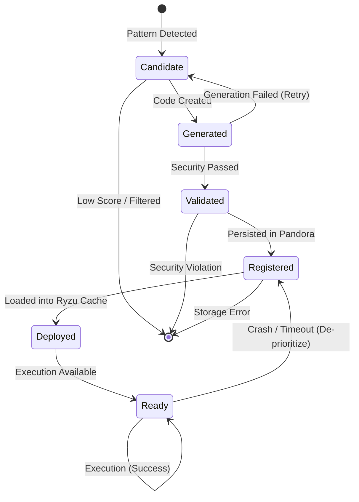

# SKILL-LIFECYCLE.md — Technical Specification

## 1. Overview
This specification defines the lifecycle of a skill within the ECHIDNA system, tracing its path from initial identification as a recurring pattern to its deployment and execution. The lifecycle ensures that skills are created efficiently, validated for security, and executed in an isolated environment with high performance.

### Lifecycle Phases
- **Detection**: Identifying potential skills from task history.
- **Generation**: Creating source code for the skill.
- **Validation**: Strict security and logic checks.
- **Registration**: Persistence and versioning in Pandora.
- **Deployment**: Caching and making the skill available.
- **Execution**: Running the skill in an isolated sandbox.
- **Result Caching**: Optimizing repeat executions.

### State Machine Diagram

## 2. Phase 1: Detection
- **Input**: Task history from Pandora (graph nodes and edges).
- **Process**: Pattern detection algorithms analyze recurring task structures. Automability scoring based on frequency, complexity, and deterministic nature.
- **Output**: `SkillCandidate` object containing metadata and identified task pattern.
- **Duration target**: < 1 second.
- **Error handling**: False positives and candidates with low automability scores are filtered immediately.

## 3. Phase 2: Generation
- **Input**: `SkillCandidate`.
- **Process**: Source code generation using LLM-driven templating or structural mapping.
- **Output**: Source code string.
- **Duration target**: < 5 seconds.
- **Languages**: 
    - **Rhai**: Used for simple logic, file operations, and string manipulation.
    - **WASM**: Used for complex tasks, ML inference, or intensive computation.
- **Error handling**: Generation failures trigger retries; syntax errors result in candidate rejection.

## 4. Phase 3: Validation
- **Input**: Generated source code.
- **Process**: Odlaguna AST parsing for structural integrity. Strict whitelist check for allowed operations. Security scan for malicious patterns.
- **Output**: `ValidationResult` (Approved/Rejected).
- **Duration target**: < 100ms.
- **Rejection reasons**: Forbidden operations, size limits exceeded, or excessive complexity.
- **Error handling**: Detailed logs of validation errors; recovery strategies include re-generating with tighter constraints.

## 5. Phase 4: Registration
- **Input**: Validated code.
- **Process**: Storing the skill in Pandora as a `ContextNode`. Linkage to relevant task types. Version tracking initialization.
- **Output**: Skill ID and registration metadata.
- **Duration target**: < 50ms.
- **Metadata**: `created_by`, `created_at`, `version`, `automability_score`.
- **Error handling**: Neo4j write failures trigger a rollback of the registration state.

## 6. Phase 5: Deployment
- **Input**: Registered Skill.
- **Process**: Skill code is loaded into the Ryzu in-memory skill cache.
- **Output**: Skill state updated to "Ready".
- **Duration target**: < 100ms.
- **Caching**: LRU (Least Recently Used) in-memory policy for fast access to high-frequency skills.
- **Error handling**: Cache full triggers eviction of low-priority skills; loading errors prevent execution.

## 7. Phase 6: Execution
- **Input**: Task matching the skill's registered pattern.
- **Process**: Ryzu invokes the skill code within an isolated environment. Monitor for timeouts and resource usage.
- **Output**: Task execution result.
- **Duration target**: Rhai < 100ms, WASM < 500ms.
- **Isolation**: Docker container (M3+ hardware) or equivalent sandbox.
- **Error handling**: Timeouts, crashes, or resource limit hits result in task failure and telemetry logging.

## 8. Phase 7: Result Caching
- **Input**: Execution result and input parameters.
- **Process**: Cache the result if the skill is marked as deterministic, using hashed parameters as the key.
- **Output**: Future matching executions return cached results.
- **Duration target**: < 1ms for cache hits.
- **Hit rate target**: > 80% for common pattern-matched tasks.
- **Error handling**: Cache invalidation on skill update; eviction based on TTL (Time To Live).

## 9. State Machine
### Formal State Transitions
| Current State | Transition Event | Next State | Failure Path |
| :--- | :--- | :--- | :--- |
| Candidate | Successful Detection | Generated | Dropped |
| Generated | Successful Compilation | Validated | Candidate (Retry) |
| Validated | Security Approval | Registered | Dead-lettered |
| Registered | Persistence Success | Deployed | Rollback |
| Deployed | Cache Load | Ready | Evicted |

### Retry and Dead-lettering
- **Retry Logic**: Up to 3 retries for generation failures with exponential backoff.
- **Dead-lettering**: Skills that fail validation or cause multiple execution crashes are moved to a dead-letter state for manual review.

## 10. Skill Types & Templates
- **Simple (Rhai)**: 
    - File system CRUD.
    - Data transformation (JSON/YAML).
    - String manipulation and regex.
- **Complex (WASM)**:
    - ML inference.
    - Cryptographic operations.
    - Large-scale data compression.
- **Decision Criteria**: Automability score (> 0.8), estimated time saved (> 10s per run), and logic complexity.

## 11. Versioning
ECHIDNA supports multiple concurrent versions of the same skill to ensure stability.

### Version Table Example
| Skill ID | Version | Type | Status | Changes |
| :--- | :--- | :--- | :--- | :--- |
| SKL-001 | v1.0.0 | Rhai | Deprecated | Initial release |
| SKL-001 | v1.1.0 | Rhai | Active | Patch for edge case |
| SKL-001 | v2.0.0 | WASM | Beta | Breaking change: performance refactor |

### Strategies
- **Rollback**: Keep the last 3 stable versions in Pandora.
- **Migration**: Deprecation notices sent to dependent agents; gradual traffic rollout for new versions.

## 12. Monitoring & Telemetry
- **Execution Metrics**: Count, success/failure rate, average latency (ms).
- **Lifecycle Metrics**: Creation rate, generation success percentage, validation rejection reasons.
- **Stability**: Circuit breaker status per skill to prevent cascading failures.

## 13. Testing Strategy
- **Unit Testing**: Validate logic for detection, generation, and validation phases independently.
- **End-to-End**: Verify the full flow from problem detection to successful skill execution.
- **Performance**: Benchmarking latency for each phase against duration targets.
- **Security**: "Red team" tests to ensure the validator catches malicious code patterns.
- **Reliability**: Stress testing repeated executions to ensure consistency and resource management.

## Constraints & Links
- **Total Time Budget**: < 10 seconds from detection to first execution.
- **Observability**: Every phase transition is logged with detailed context.
- **Strict Validation**: Whitelist approach for all skill operations.
- **Isolation**: Mandatory Docker/Sandbox execution with strict resource limits.

### Reference Links
- [REQUIREMENTS.md#RF-4](../../REQUIREMENTS.md#RF-4)
- [M4-ECHIDNA.md](../milestones/M4-ECHIDNA.md)
- [ECHIDNA.md](../modules/ECHIDNA.md)
