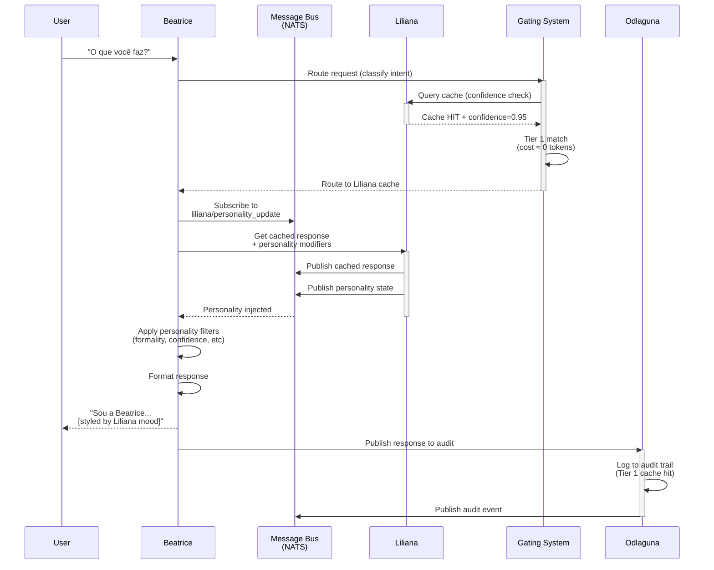
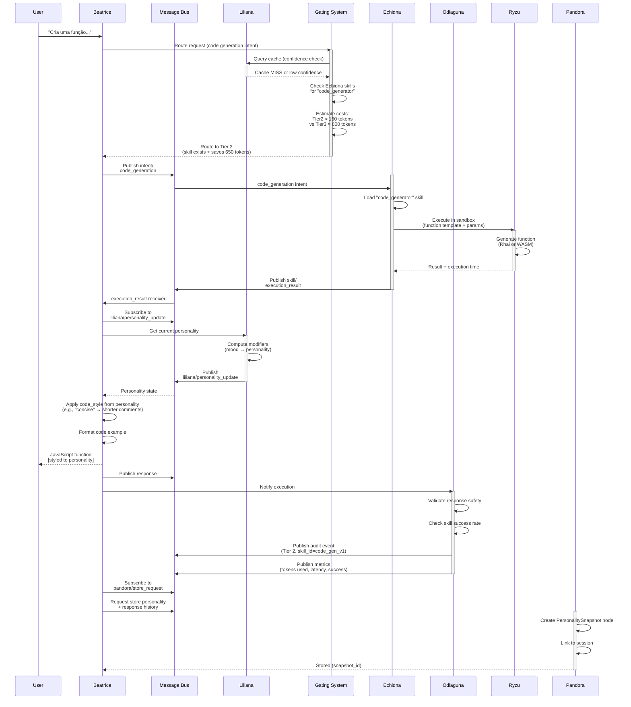
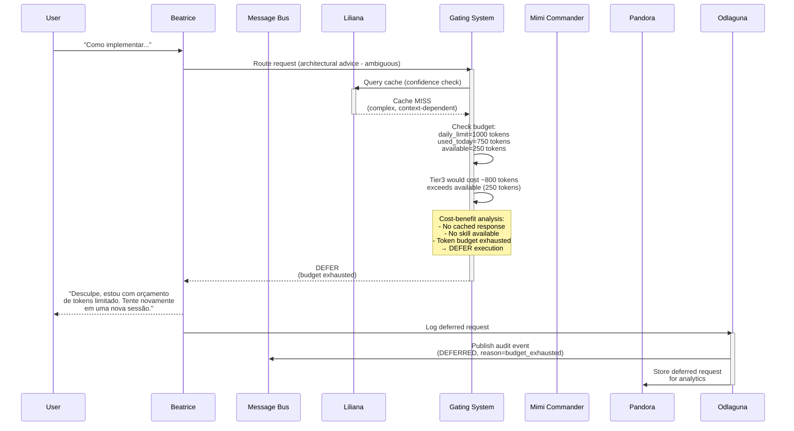
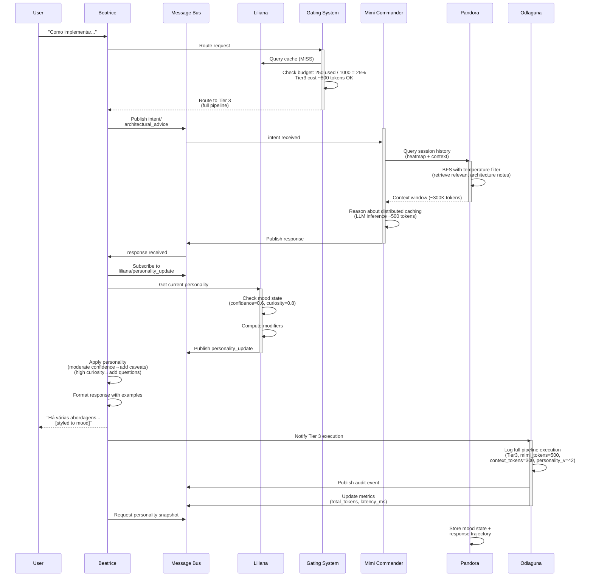
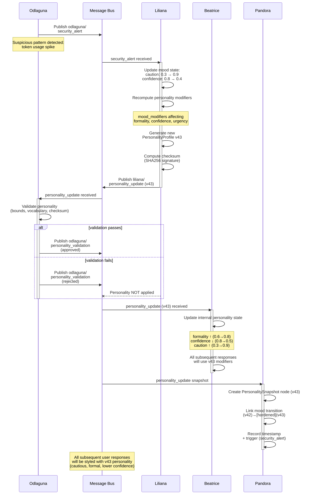
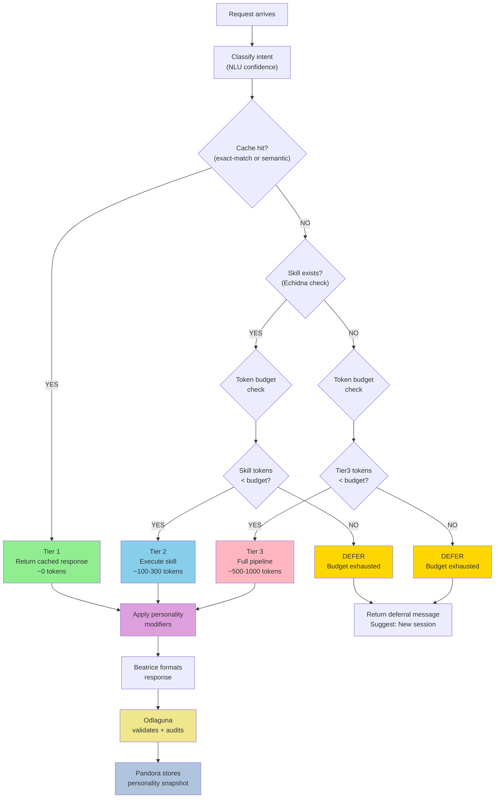
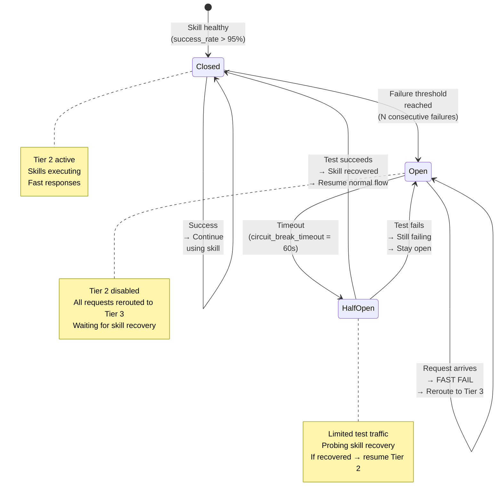
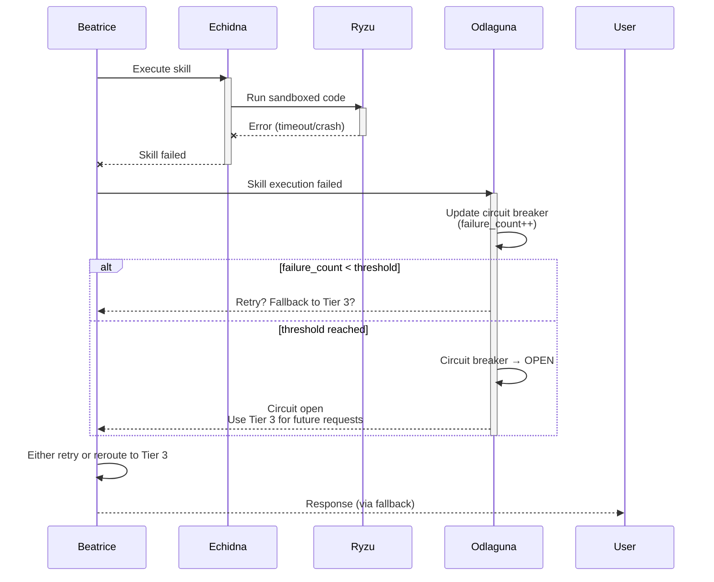
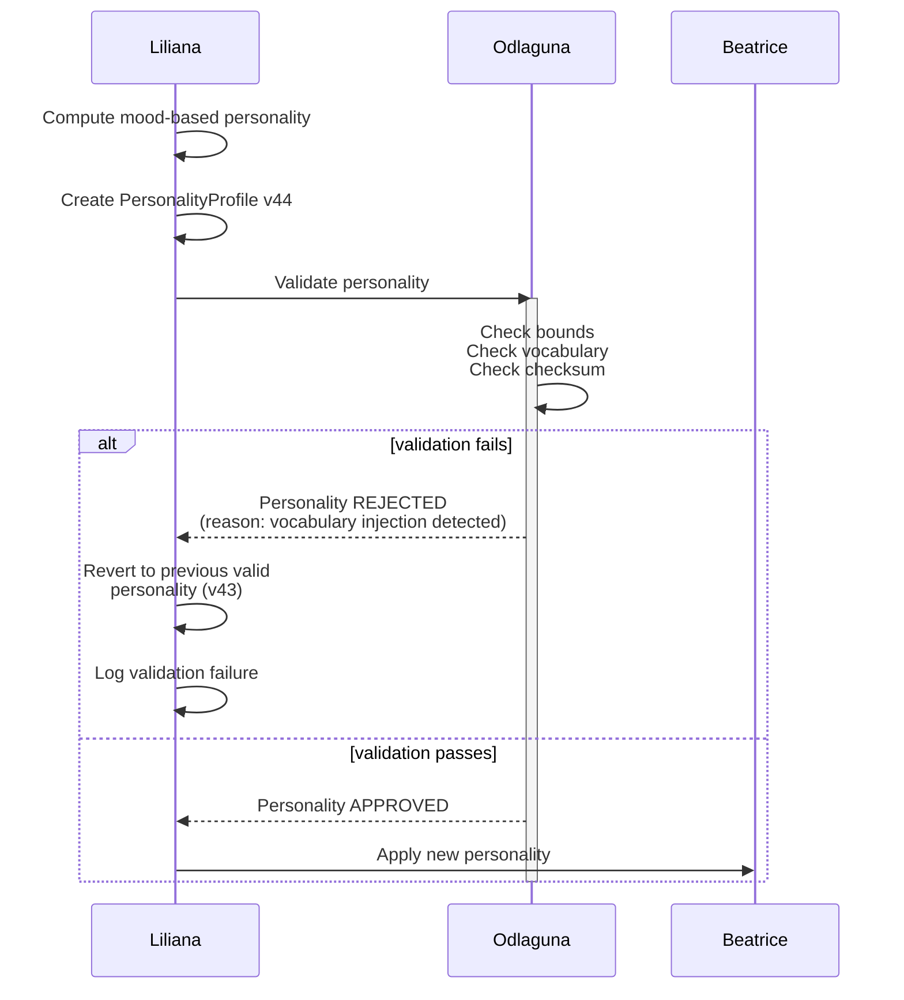

# Message Flow Diagrams: Liliana + Gating System + Persona Injection

Complete integration flows showing how all system components interact via the Message Bus.

---

## 1. Trivial Request Flow (Tier 1 - Liliana Cache Hit)

**Scenario:** User asks "O que você faz?" (What do you do?) - a common social question.



**Token Cost:** ~10 tokens (cache lookup only)  
**Latency:** ~50ms (local cache + personality application)  
**Activation:** None (Tier 1 is always available)

---

## 2. Moderate Request Flow (Tier 2 - Automated Skill)

**Scenario:** User asks "Cria uma função JavaScript para somar dois números" (Create a JS function to add two numbers).



**Token Cost:** ~150 tokens (skill execution + personality styling)  
**Latency:** ~300ms (skill execution + message bus roundtrip)  
**Activation:** Echidna + Ryzu (sandboxed execution)  
**Savings vs Tier 3:** 650 tokens (81% reduction)

---

## 3. Complex Request Flow (Tier 3 - Full Cognitive Pipeline)

**Scenario:** User asks "Como implementar um sistema de cache distribuído seguindo padrões de design?" (How to implement a distributed caching system following design patterns?).



**Alternative: Tier 3 with budget available:**



**Token Cost:** ~800 tokens (full LLM reasoning + context)  
**Latency:** ~2-3 seconds (LLM inference + context retrieval)  
**Activation:** Mimi + Pandora (full cognitive pipeline)  
**Budget Management:** May defer if budget exhausted

---

## 4. Personality State Update Flow (Mood Change)

**Scenario:** Security alert detected → Liliana shifts mood to "cautious" → All system responses harden.



**Trigger:** Odlaguna security alert  
**Propagation Time:** ~50ms (message bus latency)  
**Duration:** Until next mood reset or user override

---

## 5. Gating Decision Tree (Token Budget Management)

**Scenario:** Sequential requests with decreasing token budget.



---

## 6. Circuit Breaker Integration (Skill Reliability)

**Scenario:** A skill fails repeatedly → Circuit breaker opens → Requests route to Tier 3 instead.



**Impact on Gating:**
- When circuit is **OPEN**: Requests skip Tier 2, go directly to Tier 3
- When circuit is **HALF-OPEN**: Limited traffic to skill for testing
- When circuit is **CLOSED**: Normal Tier 2 routing

---

## 7. Full System Integration (Request to Response)

**Overview of all components interacting:**

```
┌─────────────────────────────────────────────────────────────────────┐
│                         USER INPUT                                  │
│                    "Cria uma API REST"                             │
└────────────────────────────┬────────────────────────────────────────┘
                             │
                             ▼
        ┌────────────────────────────────────────┐
        │         BEATRICE (NLP Interface)       │
        │                                        │
        │  Parse intent (Intent Extractor)      │
        │  Confidence scoring                    │
        └────────────────┬───────────────────────┘
                         │
                         ▼
        ┌────────────────────────────────────────┐
        │      GATING SYSTEM (3-Tier Router)    │
        │                                        │
        │  1. Query Liliana cache?               │
        │     → Tier 1 (~0 tokens)               │
        │                                        │
        │  2. Echidna skill exists?              │
        │     → Tier 2 (~150 tokens)             │
        │                                        │
        │  3. Full pipeline?                     │
        │     → Tier 3 (~800 tokens)             │
        │                                        │
        │  4. Budget check                       │
        │     → DEFER if exhausted               │
        └────────────────┬───────────────────────┘
                         │
              ┌──────────┼──────────┐
              │          │          │
              ▼          ▼          ▼
         ┌────────┐ ┌───────────┐ ┌─────────┐
         │Liliana │ │  Echidna  │ │  Mimi   │
         │(Cache) │ │ (Skill)   │ │(Pipeline)
         └────────┘ └───────────┘ └─────────┘
              │          │          │
              └──────────┼──────────┘
                         │
                         ▼
        ┌────────────────────────────────────────┐
        │       LILIANA (Mood + Personality)    │
        │                                        │
        │  Current mood state                    │
        │  Compute personality modifiers         │
        │  Publish PersonalityProfile            │
        └────────────────┬───────────────────────┘
                         │
                         ▼
        ┌────────────────────────────────────────┐
        │    BEATRICE (Response Styling)         │
        │                                        │
        │  Apply personality filters             │
        │  Format response                       │
        │  Render for user                       │
        └────────────────┬───────────────────────┘
                         │
                         ▼
        ┌────────────────────────────────────────┐
        │      ODLAGUNA (Safety Gating)         │
        │                                        │
        │  Validate response safety              │
        │  Check personality bounds              │
        │  Log audit trail                       │
        └────────────────┬───────────────────────┘
                         │
                         ▼
        ┌────────────────────────────────────────┐
        │    PANDORA (Memory + Persistence)     │
        │                                        │
        │  Store response history                │
        │  Store personality snapshot            │
        │  Update heatmap                        │
        └────────────────┬───────────────────────┘
                         │
                         ▼
        ┌────────────────────────────────────────┐
        │           USER OUTPUT                  │
        │   "Aqui está uma API REST seguindo..." │
        │        [Styled by Liliana mood]       │
        └────────────────────────────────────────┘
```

---

## 8. Error Recovery Flows

### 8.1 Skill Execution Failure



### 8.2 Personality Validation Failure



---

## 9. Message Bus Topic Reference

| Topic | Direction | Source | Consumer | Payload |
|-------|-----------|--------|----------|---------|
| `intent/raw` | → | Beatrice | Gating/Mimi | Intent struct |
| `liliana/personality_update` | → | Liliana | Beatrice, Odlaguna, Pandora | PersonalityInjection |
| `liliana/mood_event` | → | Liliana | Monitoring | MoodChangeEvent |
| `liliana/response_ready` | → | Liliana | Beatrice | CachedResponse |
| `gating/routing_decision` | → | Gating | Beatrice, Mimi | RoutingDecision (Tier1/2/3/Defer) |
| `skill/execute` | → | Beatrice | Echidna | SkillExecuteRequest |
| `skill/execution_result` | → | Echidna | Beatrice, Odlaguna | SkillResult |
| `task/execute` | → | Beatrice | Mimi | TaskExecuteRequest |
| `intent/response/{request_id}` | → | Mimi | Beatrice | Response |
| `odlaguna/personality_validation` | → | Odlaguna | Liliana | ValidationResult |
| `odlaguna/security_alert` | → | Odlaguna | Liliana, Mimi | SecurityAlert |
| `audit/event` | → | Odlaguna | Pandora, Monitoring | AuditEvent |
| `pandora/store_request` | → | Beatrice | Pandora | StoreRequest |
| `pandora/personality_snapshot` | → | Pandora | Monitoring | PersonalitySnapshot |

